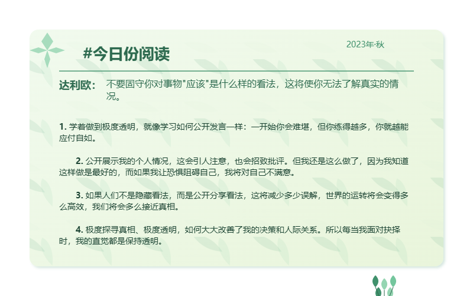
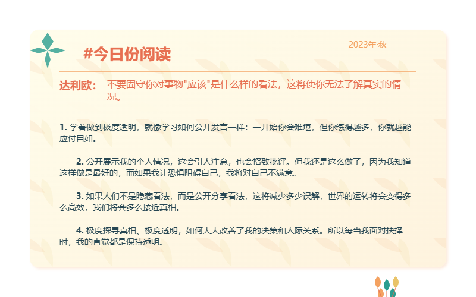

# SightBook 阅读卡片生成器


## 项目简介

SightBook 阅读卡片生成器是一个简洁易用的 Web 应用，用于创建精美的阅读笔记和思想卡片。无论是摘抄名言、记录读书感悟，还是整理个人思考，都能通过这款工具生成赏心悦目的卡片并轻松分享。

## 功能特点

- 📝 **灵活的内容编辑**：支持标题、作者、引言、正文等多项内容的个性化编辑
- 🎨 **多种主题风格**：提供春夏秋冬四种配色主题，适应不同季节和心情
- 📊 **响应式布局**：内容长度自适应，卡片高度智能调整
- 💾 **多格式导出**：支持 SVG、PNG 和 JPG 三种格式的卡片导出
- 📋 **剪贴板复制**：一键复制卡片到剪贴板，方便即时分享
- 🔍 **预览控制**：提供放大、缩小、适应屏幕和全屏预览功能
- 🚀 **实时任务进度**：直观显示导出过程和状态反馈

## 安装说明

### 环境要求

- Node.js 14.0.0 或更高版本
- npm 6.0.0 或更高版本

### 安装步骤

1. 克隆仓库

```bash
git clone https://github.com/yourusername/sightbook.git
cd sight-book
```

2. 安装依赖

```bash
npm install
```

3. 启动开发服务器

```bash
npm run dev
```

4. 构建生产版本

```bash
npm run build
```

## 使用指南

1. **编辑内容**：在左侧面板填写标题、作者、引言和正文内容
2. **选择主题**：从下拉菜单中选择春夏秋冬四种主题之一
3. **生成卡片**：点击"生成卡片"按钮预览您的卡片
4. **自定义视图**：使用放大、缩小或全屏按钮调整预览大小
5. **导出卡片**：
   - 点击"导出卡片"，选择所需格式(SVG/PNG/JPG)
   - 或选择"复制到剪贴板"直接复制卡片图像

## 技术栈

- 前端框架：React
- 样式：CSS (原生)
- 图形渲染：SVG
- 构建工具：Vite

## 样例展示




## 许可证

本项目采用 MIT 许可证。详情请查看 [LICENSE](./LICENSE) 文件。

## 联系方式

有任何问题或建议，欢迎通过以下方式联系:

- 项目 Issues: [GitHub Issues](https://github.com/li-xiu-qi/SightBook/issues)

---

SightBook © 2023 - 让阅读的思想光芒四射
